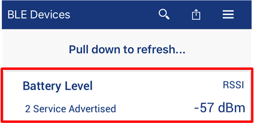
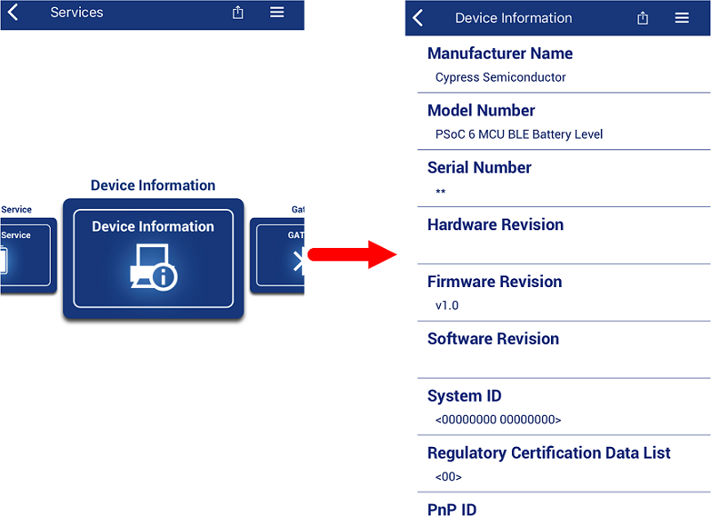
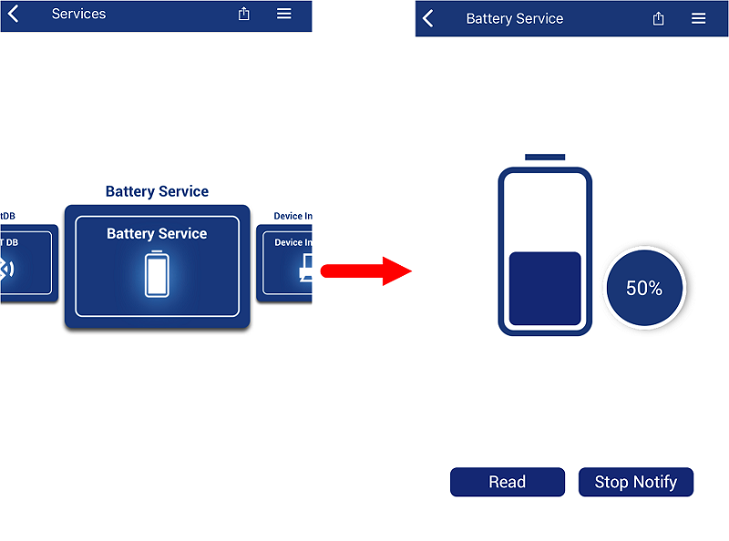
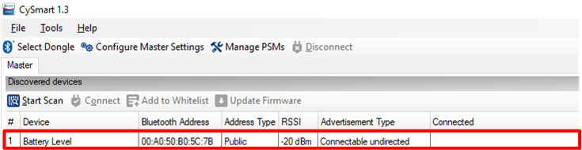
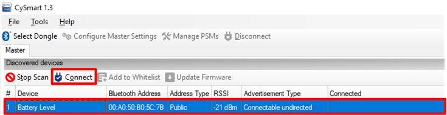
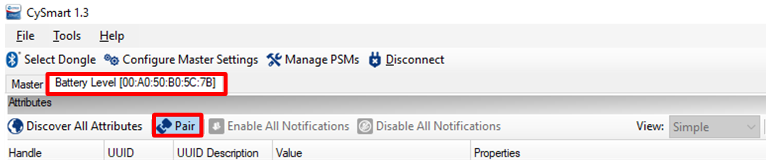
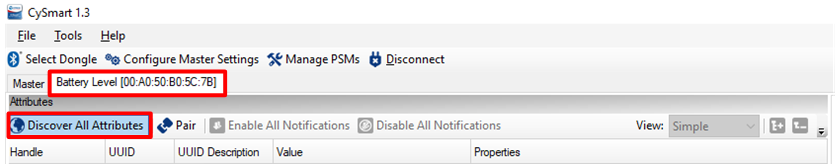
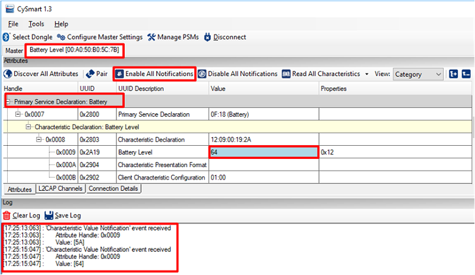
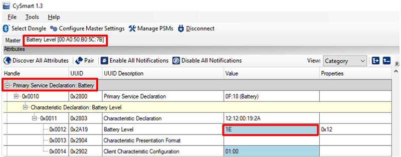
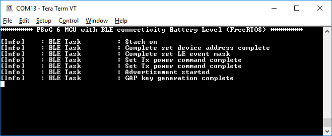

# PSoC 6 MCU with BLE Connectivity: Battery Level (FreeRTOS)

This code example demonstrates the implementation of a BLE Battery Service using PSoC® 6 MCU with Bluetooth Low Energy Connectivity (PSoC 6 BLE). This code example implements a GATT Server with the [Battery Service](https://www.bluetooth.com/specifications/gatt/viewer?attributeXmlFile=org.bluetooth.service.battery_service.xml) and [Device Information Service](https://www.bluetooth.com/specifications/gatt/viewer?attributeXmlFile=org.bluetooth.service.device_information.xml) BLE standards. 

The battery level is simulated in the firmware; its value changes continuously from 0 to 100 percent. The design uses an LED on the Kit for indication (OFF, flashing, or ON for no device connected, advertising, or connected respectively).  

The USB-BLE dongle provided with the CY8CKIT-062-BLE Pioneer kit or an iOS/Android mobile device can act as the BLE Central device.  

This code example uses FreeRTOS. Visit the [FreeRTOS website]([https://www.freertos.org](https://www.freertos.org/)) for documentation and API references.

## Requirements

- [ModusToolbox™ IDE](https://www.cypress.com/products/modustoolbox-software-environment) v2.0
- Programming Language: C
- Associated Parts: All [PSoC® 6 MCU](http://www.cypress.com/PSoC6) parts with BLE connectivity

## Supported Kits

- [PSoC 6 BLE Pioneer Kit](https://www.cypress.com/CY8CKIT-062-BLE) (CY8CKIT-062-BLE) - (Default target)
- [PSoC 6 BLE Prototyping Kit](https://www.cypress.com/CY8CPROTO-063-BLE) (CY8CPROTO-063-BLE)

## Hardware Setup
This example uses the kit’s default configuration. Refer to the kit guide to ensure that the kit is configured correctly.

**Note**: The PSoC 6 BLE Pioneer kit and the PSoC 6 WiFi-BT Pioneer kit ship with KitProg2 installed. ModusToolbox software requires KitProg3. Before using this code example, make sure that the kit is upgraded to KitProg3. The tool and instructions are available in the [Firmware Loader](https://github.com/cypresssemiconductorco/Firmware-loader) GitHub repository. If you do not upgrade, you will see an error like “unable to find CMSIS-DAP device” or “KitProg firmware is out of date”.

## Software Setup
This code example consists of two parts: a Central and a Peripheral (PSoC 6 MCU). For the Central, download and install either the [CySmart Host Emulation Tool](http://cypress.com/cysmart) PC application or the CySmart app for iOS or Android. You can test the behavior with any of the two options, but the CySmart app is simpler.  

Scan the following QR codes from your mobile phone to download the CySmart app.


Install a terminal emulator if you don't have one. Instructions in this document use [Tera Term](https://ttssh2.osdn.jp/index.html.en).

## Using the Code Example

### In ModusToolbox IDE:

1. Click the **New Application** link in the Quick Panel (or, use **File > New > ModusToolbox IDE Application**).

2. Pick a kit supported by the code example from the list shown in the **IDE Application** dialog. 

   When you select a supported kit, the example is reconfigured automatically to work with the kit. To work with a different supported kit later, use the **Library Manager** to choose the BSP for the supported kit. You can use the Library Manager to select or update the BSP and firmware libraries used in this application. To access the Library Manager, right-click the application name from the Project Workspace window in the IDE, and select **ModusToolbox > Library Manager**. For more details, see the IDE User Guide: *{ModusToolbox install directory}/ide_2.0/docs/mt_ide_user_guide.pdf*.

   You can also just start the application creation process again and select a different kit. 

   If you want to use the application for a kit not listed here, you may need to update source files. If the kit does not have the required resources, the application may not work.

3. In the **Starter Application** window, choose the example.

4. Click **Next** and complete the application creation process.

See [Importing Code Example into ModusToolbox IDE - KBA225201](https://community.cypress.com/docs/DOC-15968) for details.

### In Command-line Interface (CLI):

1. Download and unzip this repository onto your local machine, or clone the repository.

2. Open a CLI terminal and navigate to the application folder.

3. Import required libraries by executing the following command.  

   ```
   make getlibs
   ```

## Operation

1. Connect the board to your PC using the provided USB cable through the USB connector.

2. Open a terminal program and select the KitProg3 COM port. Set the serial port parameters to 8N1 and 115200 baud.

3. Program the board.

   ### Using ModusToolbox IDE:

   1. Select the application project in the Project Explorer.
   2. In the **Quick Panel**, scroll down, and click **\<Application Name> Program (KitProg3)**.

   ### Using CLI:

   From the CLI terminal, execute the following command to program for the default target (CY8CKIT-062-BLE) and toolchain (GCC_ARM).  
   ```
   make program
   ```
   You can also specify the target and tool chain. 
   ```
   make program TARGET=<BSP> TOOLCHAIN=<toolchain>
   ```
   The following command shows an example for CY8CPROTO-063-BLE and GCC_ARM toolchain:
   ```
   make program TARGET=CY8CPROTO-063-BLE TOOLCHAIN=GCC_ARM
   ```

4. After programming, the application starts automatically.

   ### Test Using the CySmart Mobile App:

   1. Turn ON Bluetooth on your Android or iOS device.

   2. Press the reset switch on the Pioneer Kit to start BLE advertisements. The user LED starts blinking to indicate that BLE advertisement has started.

   3. Pull down the CySmart app home screen to start scanning for BLE Peripherals; your device appears in the CySmart app home screen. Select your device to establish a BLE connection. Once the connection is established, the user LED turns ON.  

      ##### Figure 1. CySmart App Device Discovery
      

   4. Select the **Device Information** profile to get the manufacturer, vendor, or both information about the device, as [Figure 2]() shows.

      ##### Figure 2. CySmart App Device Information Service
      

   5. Select **Battery Service** to see the battery level. Tap on **Start Notification** to get a notification on every change in the battery level. In an iOS device, you should pair the device before accessing the Battery Service.

      ##### Figure 3. CySmart App Battery Service
      

### Test Using the CySmart Host Emulation Tool:

   1. Connect the BLE Dongle to your Windows PC. Wait for the driver installation to complete.

   2. Launch the CySmart Host Emulation Tool.

   3. Press the reset switch on the Kit to start BLE advertisements from your design. On the CySmart Host Emulation Tool, click **Start Scan**. Your device name (configured as Battery Level) should appear in the **Discovered devices** list, as shown in [Figure 4]().

      ##### Figure 4. CySmart Device Discovery
      

   4. Select your device and click **Connect** to establish a BLE connection between the CySmart Host Emulation Tool and your device, as shown in [Figure 5]().

      ##### Figure 5. CySmart Device Connection
      

   5. Once connected, switch to the **Battery Level** device tab and click **Pair** as shown in [Figure 6]().

      ##### Figure 6. CySmart Device Paining
      

   6. Click **Discover All Attributes** on your design from the CySmart Host Emulation Tool, as shown in [Figure 7]().

      ##### Figure 7. CySmart Attribute Discovery
      

   7. Scroll down the Attributes window and locate the Battery Service and then click **Enable All Notification**. The console must show the battery level as shown in [Figure 8]().

      ##### Figure 8. CySmart Enable All Notification
      

   8. Observe the change in battery level, as [Figure 9]() shows.

      ##### Figure 9. Testing with CySmart Host Emulation Tool
      

   9. Use the UART debug port to view verbose messages:

      1. The code example ships with the debug port disabled. To enable it, set the `UART_DEBUG_ENABLE` macro to `true` in *uart_debug.h* and rebuild the code.

      2. Open your terminal software and select the KitProg COM port, with a baud rate setting of 115200 bps. Set the other serial port parameters to 8N1.

      3. Program the board. Debug messages will appear in the terminal window as shown in [Figure 10]().

         ##### Figure 10. Debug Messages on COM Port
         

## Debugging

You can debug the example to step through the code. In the ModusToolbox IDE, use the **< Application Name > Debug (KitProg3)** configuration in the **Quick Panel**. See [Debugging a PSoC 6 MCU ModusToolbox Project - KBA224621](https://community.cypress.com/docs/DOC-15763) for details.

## Design and Implementation

In this code example, PSoC 6 BLE is configured in the GAP Peripheral role; GATT Server with Battery service and Device Information Service are implemented. In this code example, the security level is set to “Unauthenticated pairing with encryption”; the device needs to be paired before accessing the Battery Service. If the device is not paired, it can only access the Device Information Service. 

User LED1 is configured for indication and user button is configured as the advertise switch. A serial communication block (SCB)-based resource in UART mode is configured for printing debug messages.

The code example uses the Cypress PSoC 6 Bluetooth Low Energy Middleware. See [Bluetooth Low Energy Middleware Library](https://cypresssemiconductorco.github.io/bless/ble_api_reference_manual/html/index.html) documentation for details.

This application uses FreeRTOS; the following RTOS elements are used:

- **task_ble**: This task initializes the BLE host, registers BLE event callbacks, configures the user button, and processes the BLE events and commands from other tasks.
- **task_battery**: This task is used for simulating the battery level.
- **task_status_led**: This task is used for controlling the LED states.
- **task_debug**: This task is used for UART-based debug message printing in the terminal application. The code example ships with the debug message printing disabled. To enable it, set the `UART_DEBUG_ENABLE` macro to `true` in *uart_debug.h*.
- **Queues** are used for inter-task communications.

Visit the [FreeRTOS website]([https://www.freertos.org](https://www.freertos.org/)) for documentation and API references.

## Related Resources

| Application Notes                                            |                                                              |
| :----------------------------------------------------------- | :----------------------------------------------------------- |
| [AN228571](https://www.cypress.com/AN228571) – Getting Started with PSoC 6 MCU on ModusToolbox | Describes PSoC 6 MCU devices and how to build your first application with ModusToolbox |
| [AN221774](https://www.cypress.com/AN221774) – Getting Started with PSoC 6 MCU on PSoC Creator | Describes PSoC 6 MCU devices and how to build your first application with PSoC Creator |
| [AN210781](https://www.cypress.com/AN210781) – Getting Started with PSoC 6 MCU with Bluetooth Low Energy (BLE) Connectivity on PSoC Creator | Describes PSoC 6 MCU with BLE Connectivity devices and how to build your first application with PSoC Creator |
| [AN215656](https://www.cypress.com/AN215656) – PSoC 6 MCU: Dual-CPU System Design | Describes the dual-CPU architecture in PSoC 6 MCU, and shows how to build a simple dual-CPU design |
| **Code Examples**                                            |                                                              |
| [Using ModusToolbox IDE](https://github.com/cypresssemiconductorco/Code-Examples-for-ModusToolbox-Software) | [Using PSoC Creator](https://www.cypress.com/documentation/code-examples/psoc-6-mcu-code-examples) |
| **Device Documentation**                                     |                                                              |
| [PSoC 6 MCU Datasheets](https://www.cypress.com/search/all?f[0]=meta_type%3Atechnical_documents&f[1]=resource_meta_type%3A575&f[2]=field_related_products%3A114026) | [PSoC 6 Technical Reference Manuals](https://www.cypress.com/search/all/PSoC%206%20Technical%20Reference%20Manual?f[0]=meta_type%3Atechnical_documents&f[1]=resource_meta_type%3A583) |
| **Development Kits**                                         | Buy at Cypress.com                                     |
| [CY8CKIT-062-BLE](https://www.cypress.com/CY8CKIT-062-BLE) PSoC 6 BLE Pioneer Kit | [CY8CKIT-062-WiFi-BT](https://www.cypress.com/CY8CKIT-062-WiFi-BT) PSoC 6 WiFi-BT Pioneer Kit |
| [CY8CPROTO-063-BLE](https://www.cypress.com/CY8CPROTO-063-BLE) PSoC 6 BLE Prototyping Kit | [CY8CPROTO-062-4343W](https://www.cypress.com/cy8cproto-062-4343w) PSoC 6 Wi-Fi BT Prototyping Kit |
| [CY8CKIT-062S2-43012](https://www.cypress.com/CY8CKIT-062S2-43012) PSoC 62S2 Wi-Fi BT Pioneer Kit | |
| **Middleware**                                               | Middleware libraries are distributed on GitHub               |
| PSoC 6 Peripheral Driver Library and docs                    | [psoc6pdl](https://github.com/cypresssemiconductorco/psoc6pdl) on GitHub |
| CapSense library and docs                                    | [capsense](https://github.com/cypresssemiconductorco/capsense) on GitHub |
| Links to all PSoC 6 MCU Middleware                               | [psoc6-middleware](https://github.com/cypresssemiconductorco/psoc6-middleware) on GitHub |
| **Tools**                                                    |                                                              |
| [ModusToolbox IDE](https://www.cypress.com/modustoolbox)     | The Cypress IDE for PSoC 6 MCU and IoT designers                 |
| [PSoC Creator](https://www.cypress.com/products/psoc-creator-integrated-design-environment-ide) | The Cypress IDE for PSoC and FM0+ MCU development                |

## Other Resources

Cypress provides a wealth of data at www.cypress.com to help you to select the right device, and quickly and effectively integrate the device into your design.

For PSoC 6 MCU devices, see [How to Design with PSoC 6 MCU - KBA223067](https://community.cypress.com/docs/DOC-14644) in the Cypress community.
## Document History

Document Title: **CE225909 - PSoC 6 MCU with BLE Connectivity: Battery Level (FreeRTOS)**

| Revision | Description of Change |
| -------- | --------------------- |
| 1.0.0    | New code example      |

------

All other trademarks or registered trademarks referenced herein are the property of their respective
owners.


-------------------------------------------------------------------------------

© Cypress Semiconductor Corporation, 2019. This document is the property of Cypress Semiconductor Corporation and its subsidiaries (“Cypress”).  This document, including any software or firmware included or referenced in this document (“Software”), is owned by Cypress under the intellectual property laws and treaties of the United States and other countries worldwide.  Cypress reserves all rights under such laws and treaties and does not, except as specifically stated in this paragraph, grant any license under its patents, copyrights, trademarks, or other intellectual property rights.  If the Software is not accompanied by a license agreement and you do not otherwise have a written agreement with Cypress governing the use of the Software, then Cypress hereby grants you a personal, non-exclusive, nontransferable license (without the right to sublicense) (1) under its copyright rights in the Software (a) for Software provided in source code form, to modify and reproduce the Software solely for use with Cypress hardware products, only internally within your organization, and (b) to distribute the Software in binary code form externally to end users (either directly or indirectly through resellers and distributors), solely for use on Cypress hardware product units, and (2) under those claims of Cypress’s patents that are infringed by the Software (as provided by Cypress, unmodified) to make, use, distribute, and import the Software solely for use with Cypress hardware products.  Any other use, reproduction, modification, translation, or compilation of the Software is prohibited.
TO THE EXTENT PERMITTED BY APPLICABLE LAW, CYPRESS MAKES NO WARRANTY OF ANY KIND, EXPRESS OR IMPLIED, WITH REGARD TO THIS DOCUMENT OR ANY SOFTWARE OR ACCOMPANYING HARDWARE, INCLUDING, BUT NOT LIMITED TO, THE IMPLIED WARRANTIES OF MERCHANTABILITY AND FITNESS FOR A PARTICULAR PURPOSE.  No computing device can be absolutely secure.  Therefore, despite security measures implemented in Cypress hardware or software products, Cypress shall have no liability arising out of any security breach, such as unauthorized access to or use of a Cypress product.  CYPRESS DOES NOT REPRESENT, WARRANT, OR GUARANTEE THAT CYPRESS PRODUCTS, OR SYSTEMS CREATED USING CYPRESS PRODUCTS, WILL BE FREE FROM CORRUPTION, ATTACK, VIRUSES, INTERFERENCE, HACKING, DATA LOSS OR THEFT, OR OTHER SECURITY INTRUSION (collectively, “Security Breach”).  Cypress disclaims any liability relating to any Security Breach, and you shall and hereby do release Cypress from any claim, damage, or other liability arising from any Security Breach.  In addition, the products described in these materials may contain design defects or errors known as errata which may cause the product to deviate from published specifications.  To the extent permitted by applicable law, Cypress reserves the right to make changes to this document without further notice. Cypress does not assume any liability arising out of the application or use of any product or circuit described in this document.  Any information provided in this document, including any sample design information or programming code, is provided only for reference purposes.  It is the responsibility of the user of this document to properly design, program, and test the functionality and safety of any application made of this information and any resulting product.  “High-Risk Device” means any device or system whose failure could cause personal injury, death, or property damage.  Examples of High-Risk Devices are weapons, nuclear installations, surgical implants, and other medical devices.  “Critical Component” means any component of a High-Risk Device whose failure to perform can be reasonably expected to cause, directly or indirectly, the failure of the High-Risk Device, or to affect its safety or effectiveness.  Cypress is not liable, in whole or in part, and you shall and hereby do release Cypress from any claim, damage, or other liability arising from any use of a Cypress product as a Critical Component in a High-Risk Device.  You shall indemnify and hold Cypress, its directors, officers, employees, agents, affiliates, distributors, and assigns harmless from and against all claims, costs, damages, and expenses, arising out of any claim, including claims for product liability, personal injury or death, or property damage arising from any use of a Cypress product as a Critical Component in a High-Risk Device.  Cypress products are not intended or authorized for use as a Critical Component in any High-Risk Device except to the limited extent that (i) Cypress’s published data sheet for the product explicitly states Cypress has qualified the product for use in a specific High-Risk Device, or (ii) Cypress has given you advance written authorization to use the product as a Critical Component in the specific High-Risk Device and you have signed a separate indemnification agreement.
Cypress, the Cypress logo, Spansion, the Spansion logo, and combinations thereof, WICED, PSoC, CapSense, EZ-USB, F-RAM, and Traveo are trademarks or registered trademarks of Cypress in the United States and other countries.  For a more complete list of Cypress trademarks, visit cypress.com.  Other names and brands may be claimed as property of their respective owners.